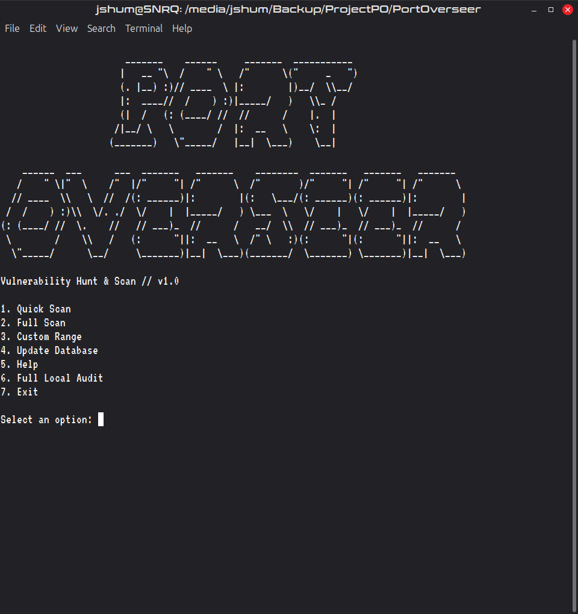
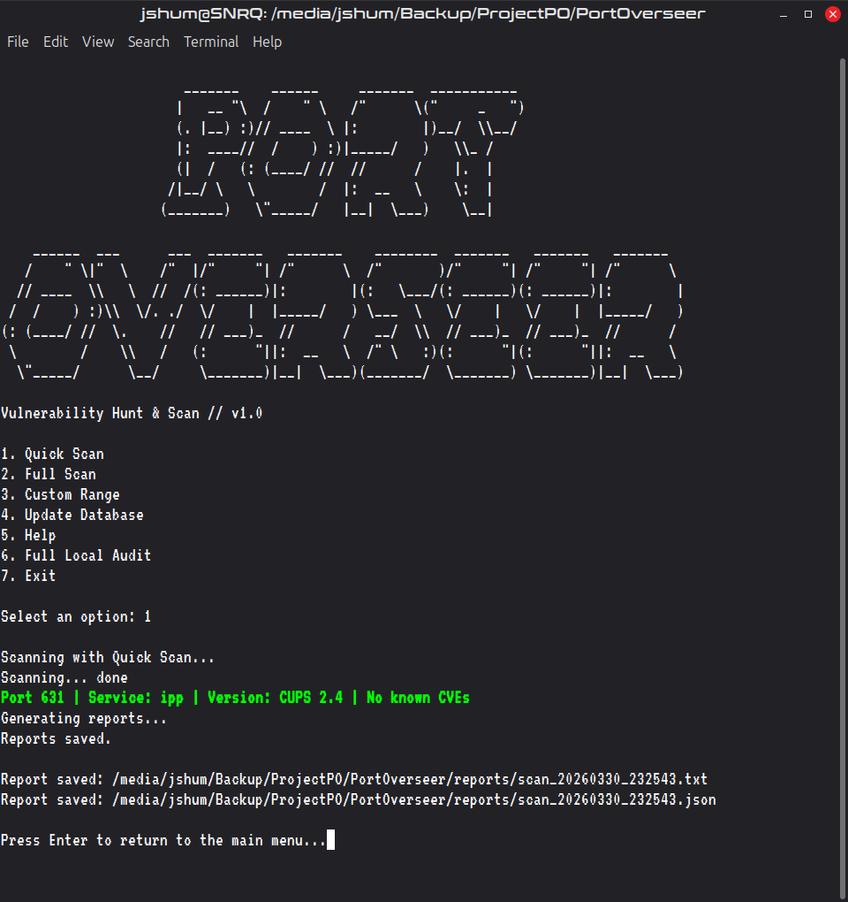

# Port Overseer
### Vulnerability Hunt & Scan


```
                       _______    ______     _______  ___________
                      |   __ "\  /    " \   /"      \("     _   ")
                      (. |__) :)// ____  \ |:        |)__/  \\__/
                      |:  ____//  /    ) :)|_____/   )   \\_ /
                      (|  /   (: (____/ //  //      /    |.  |
                     /|__/ \   \        /  |:  __   \    \:  |
                    (_______)   \"_____/   |__|  \___)    \__|

    ______  ___      ___  _______   _______    ________  _______   _______   _______
   /    " \|"  \    /"  |/"     "| /"      \  /"       )/"     "| /"     "| /"      \
  // ____  \\   \  //  /(: ______)|:        |(:   \___/(: ______)(: ______)|:        |
 /  /    ) :)\\  \/. ./  \/    |  |_____/   ) \___  \   \/    |   \/    |  |_____/   )
(: (____/ //  \.    //   // ___)_  //      /   __/  \\  // ___)_  // ___)_  //      /
 \        /    \\   /   (:      "||:  __   \  /" \   :)(:      "|(:      "||:  __   \
  \"_____/      \__/     \_______)|__|  \___)(_______/  \_______) \_______)|__|  \___)
```

> *"Scan your machine, find known vulnerabilities, get actionable fixes — no internet required."*

---

## What is Port Overseer?

Port Overseer is a locally-executed, offline-capable command-line security tool that scans your machine's open ports, identifies running services, and cross-references them against a locally-cached CVE (Common Vulnerabilities and Exposures) database sourced from NIST's National Vulnerability Database.

It generates severity-rated vulnerability reports in both `.txt` and `.json` formats, complete with remediation recommendations — all without sending your data anywhere.

**Designed for environments where internet access is restricted or untrusted.** After an initial CVE database sync, Port Overseer runs entirely air-gapped.

---

## Features

- **Three scan modes** — Quick (top 1,000 ports), Full (all 65,535 ports), and Custom Range
- **Service & version detection** — powered by Nmap's `-sV` flag
- **CVE correlation** — cross-references detected services against a local SQLite CVE database
- **Severity ratings** — Critical / High / Medium / Low based on CVSS scores
- **Color-coded terminal output** — real-time findings with severity-based highlighting
- **Dual report formats** — human-readable `.txt` and machine-readable `.json`
- **Offline-first** — runs fully air-gapped after initial database sync
- **Backup rotation** — retains last 3 CVE database snapshots automatically
- **Cross-platform** — supports Linux and Windows

---

## Requirements

- Python 3.10 or higher
- [Nmap](https://nmap.org/) installed on your system
- Administrator / root privileges (required for Nmap raw socket access)

### Python dependencies

```
python-nmap
requests
colorama
```

---

## Installation

### 1. Clone the repository

```bash
git clone https://github.com/JShum00/PortOverseer.git
cd PortOverseer
```

### 2. Create and activate a virtual environment

**Linux:**
```bash
python3 -m venv venv
source venv/bin/activate
```

**Windows:**
```cmd
python -m venv venv
venv\Scripts\activate
```

### 3. Install Python dependencies

```bash
pip install -r requirements.txt
```

### 4. Install Nmap

**Linux (Debian/Ubuntu/Mint):**
```bash
sudo apt install nmap
```

**Windows:**
Download the installer from [nmap.org](https://nmap.org/download.html) and follow the setup wizard.

---

## Usage

Port Overseer must be run with elevated privileges. I went ahead and handled that with a launcher, you're welcome.

**Linux:**
```bash
./launcher.sh
```

**Windows:**
Open an Administrator command prompt, then:
```cmd
run.bat
```

### Main Menu

```
1. Quick Scan       — Scans top 1,000 common ports
2. Full Scan        — Scans all 65,535 ports (slower)
3. Custom Range     — Scans a user-defined port range
4. Update Database  — Downloads latest CVE data from NVD
5. Help             — Shows help and usage info
6. Full Local Audit — Scans all loopback and localhost LAN ports for a full audit.
7. Exit
```

### First-time setup

On first run, select **option 4** to download the CVE database before scanning. This requires an internet connection and takes approximately 20–30 minutes to download all ~341,000 CVEs. Subsequent scans run fully offline. If you don't want to run the update function on the machine you intend to scan, you can update the application on another Trusted machine and then transfer to the untrusted machine via USB/Flash drive.

---

## Example Output

### Terminal (color-coded)


```
Scanning with Quick Scan...
Scanning... done
Port 631 | Service: ipp | Version: CUPS 2.4 | No known CVEs
Generating reports...
Reports saved.

Report saved: /path/to/PortOverseer/reports/scan_20260330_234226.txt
Report saved: /path/to/PortOverseer/reports/scan_20260330_234226.json
```

### Report files

Reports are saved to the `/reports` directory with a timestamp:

```
reports/
├── scan_20260330_200352.txt
└── scan_20260330_200352.json
```

**Sample `.txt` report:**
```
PORT OVERSEER
Scan Type: Quick Scan
Timestamp: 20260330_225133
Total Ports Scanned: 1

Summary
Total Open Ports: 1
Total CVEs Found: 0
Highest Severity: None

Findings
Port: 631 | Protocol: tcp | Service: ipp | Version: CUPS 2.4
  No associated CVEs found.

This report is intended for authorized use only. Scan target: localhost (127.0.0.1)
```

---

## Project Structure

```
port-overseer/
├── launcher.sh      # Linux Shell script to launch the program for you.
├── launcher.bat     # Windows Batch script to launch the program for you.
├── main.py          # Entry point — menu, ASCII art, routing
├── scanner.py       # Nmap integration — port/service scanning
├── cve_lookup.py    # SQLite CVE database and lookup logic
├── updater.py       # NVD data downloader with progress bar
├── reporter.py      # .txt and .json report generation
├── colors.py        # ANSI color output helpers
├── assets/
│   ├── port-overseer-1.png
│   ├── port-overseer-2.png
├── data/
│   ├── cve_db.sqlite          # Active CVE database
│   └── cve_db_backup_*.sqlite # Automatic backups (up to 3)
├── reports/         # Generated scan reports
├── requirements.txt
└── README.md
```

---

## Known Limitations

- **Scan targets** — Port Overseer scans `127.0.0.1` and optionally the host's 
LAN IP via Full Local Audit mode. Scanning external or third-party hosts is 
intentionally unsupported.
- **CVE database staleness** — The local database reflects NVD data at the time 
of the last update. Run option 4 periodically to stay current.
- **Service matching accuracy** — CVE correlation depends on Nmap's service and 
version detection. Unrecognized or generic service strings may return no CVE matches.

---

## Planned Features

- Pyinstaller builds

---

## Legal Disclaimer

> Port Overseer is intended strictly for use on systems you own or have explicit written authorization to audit. Unauthorized port scanning may violate local, state, federal, or international law. The tool scans `localhost (127.0.0.1)` only by design. The author assumes no liability for misuse of this software.

---

## Author

**Johnny Shumway**
Cybersecurity student | Aspiring SOC Analyst
Built for the Handshake × OpenAI Codex Creator Challenge — March 2026

---

## Acknowledgements

- [NIST National Vulnerability Database](https://nvd.nist.gov/) — CVE data source
- [Nmap](https://nmap.org/) — port scanning engine
- [OpenAI Codex](https://openai.com/) — used to build this project